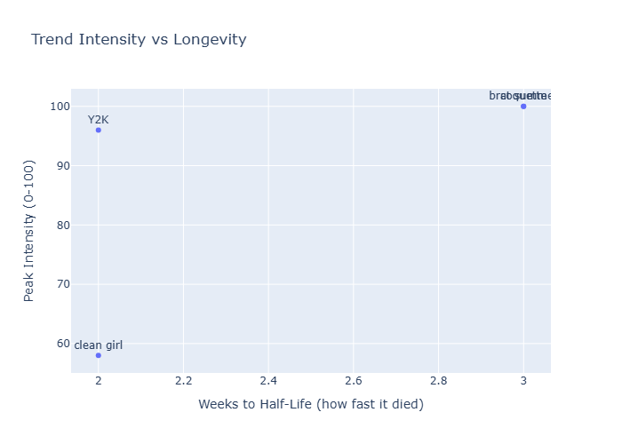
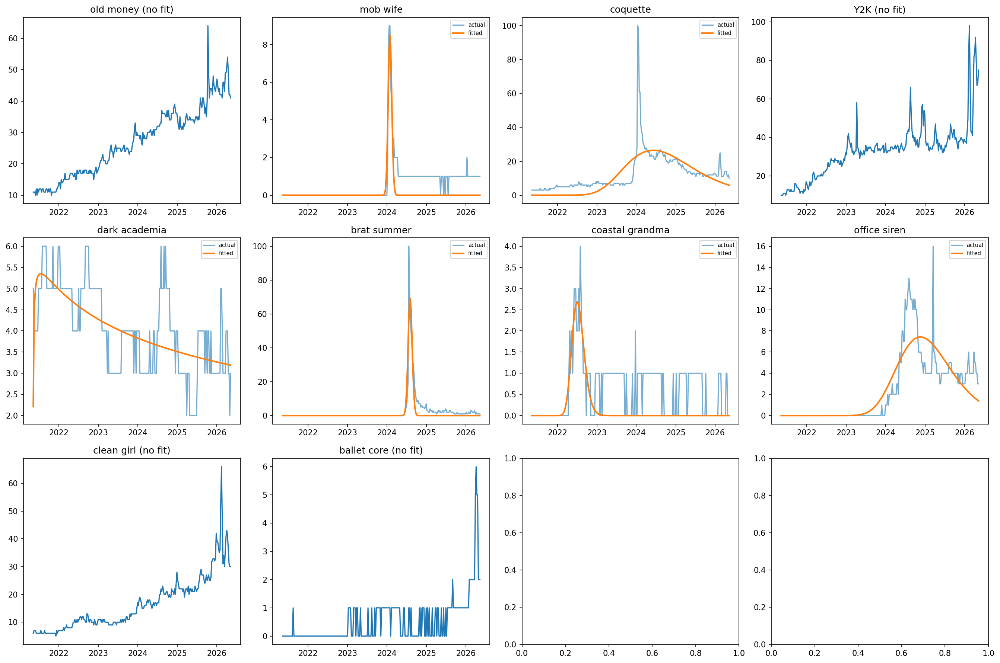

# Fashion Micro-Trend Lifecycle Modeler

## Overview
This project models the lifecycle of fashion micro-trends using data from Google Trends. Each trend is treated as a curve with a birth, peak, and death. My goal is to quantify the speed at which these microtrends rise and fall, and also whether varying types of trends follow different patterns.

## Data Source
- **Google Trends** via pytrends Python library
- Weekly search interest scores (0-100) over a span of 5 years (2021-2026)
- 10 fashion micro-trends analyzed

## Methology
Each trend's time series was fit to a log-normal curve using scipy's curve_fit function. Three parameters were extracted per trend:
- **Amplitude** - how high the peak reached
- **Sigma** - how wide/narrow the curve is (small sigma means sharper spike)
- **R^2** - how well the log-normal graph fits the real data 

## Findings

### 1. Not all trends follow a log-normal lifecycle
6 of the 10 trends were successfully fitted. The 4 that failed can be sorted into two categories:
- **Still growing**: old money, clean girl, Y2K - no clear decay yet
- **Too flat**: balletcore - likely a Tiktok-native trend with minimal Google searchs

### 2. Brat summer had the cleanest lifecycle
With an R^2 value of 0.828, brat summer most closely followed a log-normal curve with a sharp music-driven spike in July 2024 followed by rapid decay within weeks.

### 3. Peak intensity and half-life appear unrelated
Trends that hit 100/100 on Google Trends (coquette, brat summer) died just as fast as trends that peaked much lower. Greater virality does not imply longevity.

### 4. Google Trends undercounts Tiktok-native trends
Trends with self-explanatory names (old money, clean girl, ballet core) show lower Google search interest relative to their actual cultural reach, since audiences consume them on Tiktok without the need to search them on Google.

### Limitations
- Google Trends data is normalized (0-100) and relative, not absolute search volume
- Tikotk lifecycle data was unavailable, the Tiktok Research API would allow for more complete analysis in future work
- Sample size of 10 trends is small so conclusions are directional and not wholly definitive

## Tools Used
Python, pandas, pytrends, scipy, matplotlib, plotly

## Visualizations

## Visualizations

### Trend Search Interest Over Time

### Trend Intensity vs Longevity

### Lifecycle Curve Fitting

